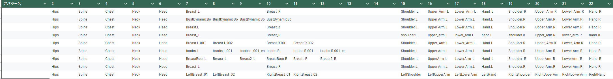
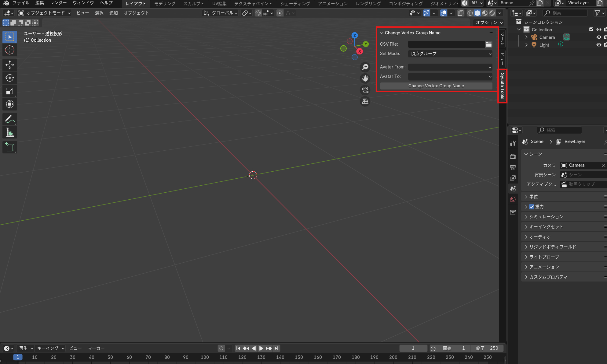

# syuuta_blenderTools
    Blenderで衣装対応をする際に少し便利になるツール

## できること
    csvファイルをもとに、衣装対応時のボーン名変更もしくは頂点グループ名変更を一括でできるツール

## 使い方
1. ボーン情報をまとめたcsv ファイルを用意する　　
    1列目 にアバター名を入れる  
        ここで入力した情報が Blender 側で表示されます  
    2列目 以降に列ごとに対応するボーンを入力する  

    - 例. csv の構成
    

1. Blender でインポートを行う
   
2. 下記画像のところでパラメータの設定を行う
   

   パラメータの設定内容
   |項目|設定内容|
   |---|---|
   |CSV File|一番最初に作成をしたcsvファイルを選択|
   |Set Mode|`頂点グループ名` か `ボーン` の名前を変更するか選択|
   |Avater From|変更元のアバター名を選択|
   |Avatar To|変更先のアバター名を選択|

3. ボーンの名前を変更する　　
    変更を行いたいアバターを選択状態にし
    `Change Vertex Group Name` を押下

## バージョンの説明
最初の数字は大きな変更があった時に上げる
2番目の数字は機能追加や変更があった時に上げる
3番目の数字はバグ修正や細かい変更があった時に上げる

## 更新履歴
* v0.0.1
    csv ファイルを読み込み、頂点グループ名を変更する昨日のテスト版を作成

* v0.0.2
    複数メッシュを選択し、実行した際にエラーになるのを修正

* v0.0.3
    相対パスでも読み込めるように更新

* v0.1.0
    モードを追加
    - vertex_group_name を変更するか、bone の名前を変更するか選択できるように更新

* v0.1.1
    boneの名前を変更する際に、意図しない番号になってしまうのを修正
    コレクション削除時に実行した際にエラーになるのを修正

* v1.0.0
    リリース版